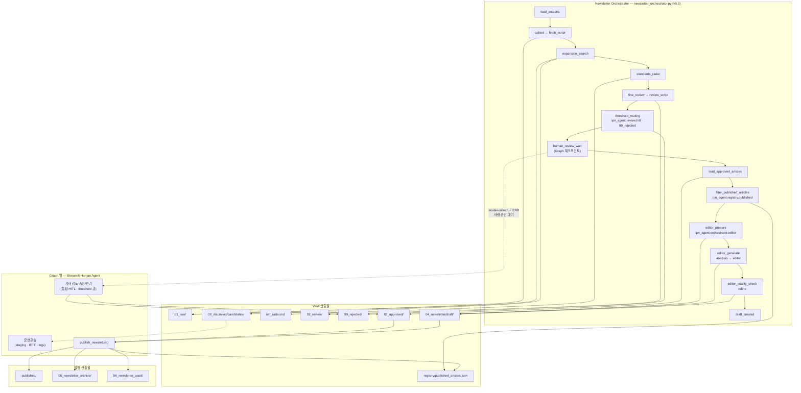
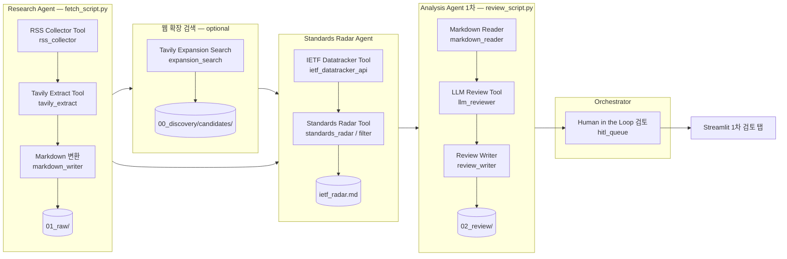
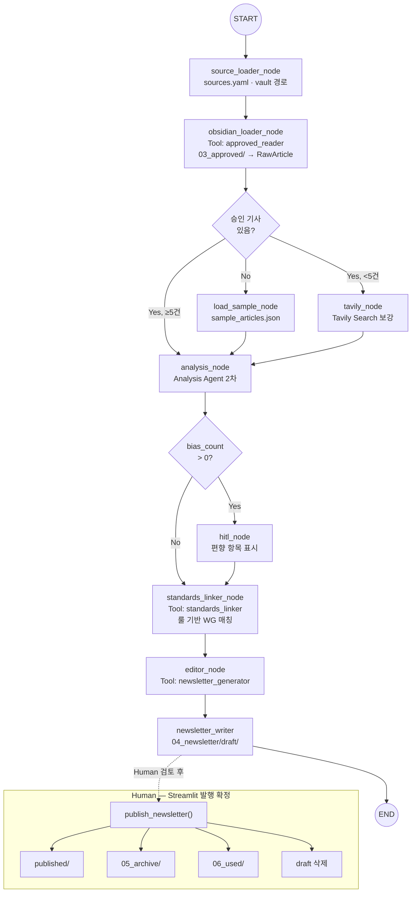
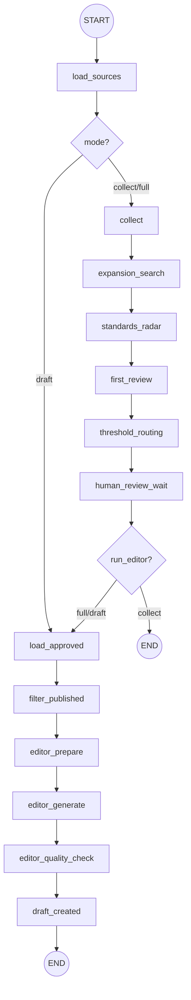

# Multi-Agent 기반 IP Network 기술 동향 뉴스레터 Agent

---

> **작성자:** IP Network 담당  
> **작성일:** 2026-06-24 (v1.8 갱신: 2026-07-01)  
> **버전:** v1.8  
> **상태:** 🟢 MVP v0.7 — 통합 HITL · Tavily 자동 파이프라인 · Newsletter Orchestrator ✅ / Chat UI ⬜  
> **분류:** AI Agent / LangGraph / Hackathon Day 8  
> **관련 문서:** [docs/README.md](./README.md) · [changelog.md](./changelog.md) · [project-structure.md](./project-structure.md)

---

## 목차

1. [과제 개요](#1-과제-개요)
2. [과제 목표](#2-과제-목표)
3. [MVP 범위](#3-mvp-범위)
4. [최종 산출물 방향](#4-최종-산출물-방향)
5. [전체 구조](#5-전체-구조)
6. [기술 설계](#6-기술-설계)
7. [Pipeline vs Multi-Agent — 본 과제의 선택](#7-pipeline-vs-multi-agent--본-과제의-선택)
8. [데이터 수집 방식](#8-데이터-수집-방식)
9. [뉴스레터 카테고리](#9-뉴스레터-카테고리)
10. [참조 소스 후보](#10-참조-소스-후보)
11. [Streamlit 뉴스레터 보드](#11-streamlit-뉴스레터-보드)
12. [Chat UI 시연](#12-chat-ui-시연)
13. [실패하면 안 되는 케이스](#13-실패하면-안-되는-케이스)
14. [Day 1~7 패턴 적용 계획](#14-day-17-패턴-적용-계획)
15. [기술 스택](#15-기술-스택)
16. [개발 우선순위](#16-개발-우선순위)
17. [산출물](#17-산출물)
18. [시연 시나리오](#18-시연-시나리오)
19. [성공 기준](#19-성공-기준)
20. [향후 고도화 방향](#20-향후-고도화-방향)
21. [요약](#요약)

---

## 1. 과제 개요

### 1.1 과제명

**Multi-Agent 기반 IP Network 기술 동향 뉴스레터 Agent**

### 1.2 추진 배경

IP Network 영역은 Backbone, Backhaul, Data Center Network, IP 보안, NetDevOps, 표준화 동향 등 다양한 기술 변화가 지속적으로 발생하고 있다.

그러나 관련 정보는 표준화 사이트, 기술 커뮤니티, 벤더 블로그, 오픈소스 커뮤니티 등에 분산되어 있어 담당자가 매번 직접 확인하고 선별해야 한다.

**현재 Pain Point:**


| 구분    | 현황                         | 문제                   |
| ----- | -------------------------- | -------------------- |
| 정보 분산 | 표준화 사이트, 벤더 블로그, 커뮤니티 등 다수 | 매번 직접 방문·확인 필요       |
| 벤더 편향 | 벤더 블로그는 홍보성 내용 혼재          | 기술 사실과 마케팅 표현 구분 어려움 |
| 분류·요약 | 수작업으로 분류·정리                | 시간 비용 과다             |


본 과제는 사전에 정의한 공개 RSS Feed, API(IETF), blog_index URL을 제한적으로 수집하고,
**역할별 Multi-Agent + LangGraph Orchestrator**가 협업하여 IP Network 기술 동향을 분류·요약·검증·편집한 뒤
**Streamlit 뉴스레터 보드**와 **Chat UI**로 시연하는 Agent MVP를 구현하는 것을 목표로 한다.

> **Multi-Agent 핵심:** Research · Analysis · Editor 역할을 **서로 다른 Agent**가 담당한다.  
> Agent 간 산출물은 Obsidian Vault(`01_raw` ~ `04_newsletter`)를 **공유 Artifact Store**로 교환한다.  
> Vault는 레거시 ETL 파이프라인이 아니라, **에이전트 협업·HITL·재현 가능한 중간 결과**를 위한 설계다.

> ℹ️ Day 8 미니 해커톤의 시간 제약을 고려하여, 실제 운영 가능한 뉴스레터 시스템이 아니라 **Agent 구조와 결과 화면이 명확히 보이는 데모 가능한 MVP** 구현에 초점을 둔다.

---

## 2. 과제 목표

### 2.1 핵심 목표


| No  | 목표                                                        |
| --- | --------------------------------------------------------- |
| 1   | **Research Agent**가 RSS/API/blog_index 소스를 제한적으로 수집한다     |
| 2   | 수집 실패 시 **Editor Orchestrator**가 샘플 데이터로 fallback한다       |
| 3   | **Analysis Agent**가 문서를 IP Network 카테고리별로 분류한다            |
| 4   | Analysis Agent가 한국어 뉴스레터 형식으로 요약한다                        |
| 5   | Analysis Agent + LLM-as-Judge가 벤더 편향을 검토·표시한다             |
| 6   | **Editor Agent** 결과를 Streamlit 뉴스레터 보드로 보여준다              |
| 7   | LangGraph Chat UI로 동일 Multi-Agent 흐름을 대화형 시연한다            |
| 8   | **Human Agent(HITL)** 검수와 **Standards Radar Agent**를 병행한다 |


> **최종 산출물(고정):** Streamlit **뉴스레터 보드**(메인) + LangGraph **Chat UI**(보조).  
> Agent 간 handoff는 Vault Markdown(`01_raw` ~ `04_newsletter`)으로 관리한다.

---

## 3. MVP 범위

### 3.1 포함 범위


| 구분                    | MVP 포함 범위                                                            |
| --------------------- | -------------------------------------------------------------------- |
| **Multi-Agent 역할**    | Research · Analysis · Editor · Standards Radar · Human(HITL)         |
| **Orchestrator**      | LangGraph StateGraph — **`newsletter_orchestrator.py`** → `ipn_agent.orchestrator.workflow` (collect~draft) + **`ipn_agent.orchestrator.editor`** |
| Research Agent        | `fetch_script.py` → `ipn_agent.collect.fetch` → Vault `01_raw/`      |
| Analysis Agent (1차)   | `review_script.py` → `ipn_agent.review.runner` → Vault `02_review/`  |
| **Threshold HITL**    | `ipn_agent.review.hitl` + `ipn_agent.orchestrator.hitl_apply` — score 기반 큐 분류 (LLM 없음) |
| Human Agent (HITL)    | **Streamlit 기사 검토** 탭 → Vault `03_approved/` / `99_rejected/` (최종 approved는 사람만) |
| Collect Orchestrator  | `research_review_agent.py` → `ipn_agent.orchestrator.research_agent` (subprocess, 레거시) |
| **Newsletter Orchestrator** | `newsletter_orchestrator.py` — 단일 StateGraph (v0.6) |
| **Editor 모듈**       | `ipn_agent.orchestrator.editor` — prepare / generate / refine (Orchestrator node에서 호출) |
| **Published Registry**| `ipn_agent.registry.published` → `vault/registry/published_articles.json` |
| Standards Radar Agent | `standards_radar_script.py` → `ipn_agent.standards.radar` → `04_newsletter/ietf_radar.md` |
| **Python 패키지**     | `ipn_agent/` — 역할별 서브패키지, 루트 CLI wrapper 유지 ([project-structure.md](./project-structure.md)) |
| Standards Linker      | `standards_linker_node` (`ipn_agent.legacy.skeleton`, LLM 없음) → `standards_context` |
| Editor Agent          | `editor_node()` · `ipn_agent.orchestrator.editor` → `04_newsletter/draft/` |
| **공유 Artifact Store** | Obsidian Vault — Agent 간 handoff·HITL·발행 스냅샷 |
| 메인 UI                 | Streamlit v0.7 — **5탭** + **Newsletter Orchestrator** + 통합 HITL |
| 보조 UI                 | LangGraph dev + Chat UI (`newsletter_agent_skeleton.app`, deprecated) |
| 데이터 수집                | RSS / blog_index / API(IETF) / Tavily Extract                        |
| Fallback              | `load_sample_node()` ← `sample_articles.json`                        |
| 분류                    | IP Network 카테고리 + `importance_score` · `topic_tags`                  |
| 요약                    | 한국어 헤드라인·3~5줄 요약·뉴스레터 후보 문장                                          |
| 검증                    | Analysis Agent + LLM-as-Judge + Human Agent(HITL)                    |
| 결과 저장                 | Vault Markdown + JSON *(Streamlit·Chat UI 연동)*                       |
| 발표 산출물                | `docs/` 문서, `docs/sources-checklist.md`, 시연 시나리오                              |


### 3.2 제외 범위


| 구분                  | MVP 제외 범위     | 사유                                                                                |
| ------------------- | ------------- | --------------------------------------------------------------------------------- |
| 대규모 웹 크롤링           | 제외            | 해커톤 시간 및 안정성 이슈                                                                   |
| Tavily / Web Search | **제한 조건부 사용** | RSS 수집 후 카테고리 공백(`Standards/Architecture`, `기간망/DCI`) 시만 보강. `max_queries: 2`로 제한 |
| MCP 실제 연동           | 제외            | Day 8 범위 초과 가능                                                                    |
| Gmail 발송            | 제외            | 외부 서비스 연동에 해당                                                                     |
| Slack 공유            | 제외            | 외부 서비스 연동에 해당                                                                     |
| Confluence 자동 작성    | 제외            | 후속 확장 후보                                                                          |
| Reddit 커뮤니티         | **제외**        | 노이즈·신뢰도 — `excluded_sources`                                                      |
| 실운영 스케줄링            | 제외            | MVP 범위 초과                                                                         |
| 사용자별 개인화            | 제외            | 후속 고도화 범위                                                                         |


### 3.3 Agent 구현 현황 (2026-07-01)


| Agent / 구성요소              | CLI / 구현 모듈                    | Vault handoff                         | 상태          |
| ------------------------- | ------------------------------ | ------------------------------------- | ----------- |
| **Research Agent**        | `fetch_script.py` → `ipn_agent.collect.fetch` | `01_raw/{source_id}/`     | ✅           |
| **Collect Orchestrator**  | `research_review_agent.py` → `ipn_agent.orchestrator.research_agent` | fetch → expansion → radar → review | ✅ |
| **Newsletter Orchestrator** | `newsletter_orchestrator.py` → `ipn_agent.orchestrator.workflow` | `NewsletterWorkflowState` + `output/pipeline_runs/` | ✅ v0.6 |
| **Editor 모듈**           | `ipn_agent.orchestrator.editor` | prepare / generate / refine 함수     | ✅ v0.6 |
| **Threshold HITL**        | `ipn_agent.review.hitl` · `ipn_agent.orchestrator.hitl_apply` | `02_review` frontmatter · `99_rejected/` | ✅ v0.5 |
| **Published Registry**    | `ipn_agent.registry.published` | `registry/published_articles.json`    | ✅ v0.5      |
| **Analysis Agent (1차)**   | `review_script.py` → `ipn_agent.review.runner` | `02_review/`              | ✅           |
| **Human Agent (HITL)**    | `streamlit_app.py` + `ipn_agent.vault.utils` | `03_approved/` · `99_rejected/` | ✅ |
| **Standards Radar Agent** | `standards_radar_script.py` → `ipn_agent.standards.radar` | `04_newsletter/ietf_radar.md` | ✅ |
| **Standards Linker**      | `standards_linker_node` (`ipn_agent.legacy.skeleton`) | `ArticleAnalysis.standards_context` | ✅ |
| **Editor (Chat UI)**      | `newsletter_agent_skeleton.py` → `ipn_agent.legacy.skeleton` | `04_newsletter/draft/` (deprecated) | ✅ |
| **발행 관리**               | `ipn_agent.vault.utils.publish_newsletter` | `04_newsletter/published/` | ✅ |
| **Presentation Layer**    | Streamlit + Chat UI            | —                                     | ✅ Streamlit / ⬜ Chat |
| **Tool 로깅**              | `ipn_agent.core.tool_logger`   | `logs/tool_runs.jsonl`                | ✅           |
| **MVP 상한**               | `ipn_agent.core.mvp_limits`    | `.env`                                | ✅           |
| **Tavily Discovery**      | `ipn_agent.collect.discovery`  | `01_raw/expansion/` → `02_review/`    | ✅ v0.7      |
| **Review 메타**           | `ipn_agent.review.metadata`    | `02_review/` frontmatter 정규화       | ✅ v0.7      |
| 유틸                        | `reset_vault.py` → `ipn_agent.vault.reset` | Artifact Store 초기화        | ✅           |


> 상세 소스·테스트: `sources.yaml`, [docs/sources-checklist.md](./sources-checklist.md) 참고.

---

## 4. 최종 산출물 방향

### 4.1 메인 산출물 — Streamlit 뉴스레터 보드

본 과제의 메인 산출물은 단순 Chatbot이 아니라, **IP Network 기술 동향을 한눈에 볼 수 있는 Streamlit 뉴스레터 보드**이다.

Streamlit 화면에서는 다음 정보를 확인할 수 있다.

- 오늘의 핵심 헤드라인
- 카테고리별 기술 동향 요약
- 원문 링크
- 핵심 키워드
- 벤더 소스 여부
- 편향/홍보성 표현 검토 결과
- 추가 검토 필요 항목

### 4.2 보조 산출물 — Chat UI

Day 8 해커톤의 기본 실행 흐름에 맞춰 `langgraph dev`와 Chat UI도 함께 구성한다.

Chat UI에서는 사용자가 다음과 같은 질문을 입력하고 Agent 응답을 확인할 수 있다.

```
이번 주 IP Network 기술 동향을 뉴스레터 형식으로 정리해줘.
벤더 홍보성 표현이 있는 항목만 따로 보여줘.
Data Center Network 관련 내용만 요약해줘.
```

> **역할 분리:** Streamlit은 전체 뉴스레터 판 / Chat UI는 Agent와 대화하는 보조 시연 채널

---

## 5. 전체 구조

### 5.0 Multi-Agent 협업 구조

본 MVP는 **역할별 Agent가 분업**하고, **LangGraph Orchestrator**가 Editor 흐름을 조율하는 Multi-Agent 시스템이다.

Obsidian Vault는 ETL 파이프라인 단계가 아니라, **Agent 간 공유 Artifact Store**다.
각 Agent는 Vault 폴더에 Markdown 산출물을 남기고, 다음 Agent가 이를 읽어 판단한다.

```
┌─────────────────────────────────────────────────────────────────────┐
│                    Multi-Agent Newsletter System                     │
├─────────────────────────────────────────────────────────────────────┤
│  Research Agent          Analysis Agent (1차)    Human Agent (HITL)      │
│  fetch_script.py    →    review_script.py   →    Streamlit Admin       │
│       │                        │                        │           │
│       ▼                        ▼                        ▼           │
│  vault/01_raw/          vault/02_review/         vault/03_approved/│
├─────────────────────────────────────────────────────────────────────┤
│  Standards Radar Agent (IETF 전용, Collect & Analyze 시 병렬)           │
│  standards_radar_script.py  →  vault/04_newsletter/ietf_radar.md      │
├─────────────────────────────────────────────────────────────────────┤
│  Collect Orchestrator — research_review_agent.py (subprocess)          │
│    fetch → expansion → standards_radar → review → HITL Queue Ready   │
├─────────────────────────────────────────────────────────────────────┤
│  Newsletter Orchestrator — newsletter_orchestrator.py (LangGraph, v0.6)  │
│    load_sources → collect → expansion → radar → first_review         │
│      → threshold_routing → human_review_wait                         │
│      → load_approved → filter_published                              │
│      → editor_prepare → editor_generate → editor_quality_check       │
│      → draft_created                                                 │
├─────────────────────────────────────────────────────────────────────┤
│  Editor 함수 — ipn_agent.orchestrator.editor (Orchestrator node에서 호출) │
│    prepare_newsletter_context → generate_newsletter_draft            │
│      → refine_newsletter_draft → draft/                              │
├─────────────────────────────────────────────────────────────────────┤
│  Editor subgraph (deprecated) — newsletter_agent_skeleton.py → ipn_agent.legacy.skeleton │
│    obsidian_loader → [load_sample | tavily] → analysis              │
│      → [hitl] → standards_linker → editor → draft/  (Chat UI 전용)   │
├─────────────────────────────────────────────────────────────────────┤
│  Presentation Layer (최종 산출물)                                    │
│  Streamlit 뉴스레터 보드 (메인)  +  LangGraph Chat UI (보조)          │
└─────────────────────────────────────────────────────────────────────┘
```

#### Agent 역할 정의


| Agent                     | 역할·판단 책임                               | CLI / 구현 모듈                        | Vault handoff               |
| ------------------------- | -------------------------------------- | ---------------------------------- | --------------------------- |
| **Research Agent**        | 어떤 소스를 수집할 것인가? RSS/API/blog_index 선택  | `fetch_script.py` → `ipn_agent.collect.fetch` | `01_raw/`                   |
| **Analysis Agent (1차)**   | 카테고리·요약·편향·중요도·topic_tags              | `review_script.py` → `ipn_agent.review.runner` | `02_review/`                |
| **Human Agent (HITL)**    | threshold 큐 + 뉴스레터 포함 최종 승인/반려        | `streamlit_app.py` + `ipn_agent.vault.utils` | `03_approved/` · `99_rejected/` |
| **Threshold Router**      | score → approval_pending / needs_human_review / rejected | `ipn_agent.review.hitl` | `02_review` frontmatter |
| **Published Guard**       | 기발행 기사 draft·HITL 재진입 차단               | `ipn_agent.registry.published` | `registry/published_articles.json` |
| **Standards Radar Agent** | IETF WG 표준 변화 신호 감지 (뉴스 ❌)             | `standards_radar_script.py` → `ipn_agent.standards.radar` | `ietf_radar.md`  |
| **Standards Linker**      | 기사별 IETF 표준 맥락 연결 (LLM 없음)            | `standards_linker_node` (`ipn_agent.legacy.skeleton`) | `standards_context` |
| **Analysis Agent (2차)**   | 승인 기사 재분류·Judge·뉴스레터용 정제               | `analysis_node()` (`ipn_agent.legacy.skeleton`) | State `analyzed_articles`   |
| **Editor Agent**          | 카테고리별 편집·draft Markdown 생성              | `editor_node()` · `ipn_agent.orchestrator.editor` | `04_newsletter/draft/`    |
| **Newsletter Orchestrator** | collect~draft 단일 Graph · editor node 3분할 | `newsletter_orchestrator.py` → `ipn_agent.orchestrator.workflow` | `NewsletterWorkflowState` |
| **Editor subgraph (deprecated)** | Chat UI fallback·Tavily 보강 | `newsletter_agent_skeleton.py` → `ipn_agent.legacy.skeleton` | LangGraph `NewsletterState` |


> **왜 스크립트 + LangGraph 혼합인가?**  
> Research·Analysis(1차)는 해커톤 전 **배치 Agent**로 안정적으로 돌리고,  
> v0.6부터 **Newsletter Orchestrator**가 collect~draft를 단일 Graph로 조율한다.  
> Editor subgraph(`app`)는 Chat UI 시연용으로만 유지한다.  
> Vault handoff는 프로덕션 Multi-Agent에서 흔한 **비동기 Agent 협업 패턴**이다.

### 5.1 Vault = Agent 공유 Artifact Store

Vault 폴더는 파이프라인 단계 번호가 아니라, **Agent handoff 지점**이다.


| Vault 폴더         | 쓰는 Agent                            | 읽는 Agent                                     | 의미                |
| ---------------- | ----------------------------------- | -------------------------------------------- | ----------------- |
| `01_raw/`        | Research Agent                      | Analysis Agent (1차), Standards Radar Agent   | 수집 원문 Artifact    |
| `02_review/`     | Analysis Agent (1차) · Threshold Router | Human Agent (**Streamlit**)            | LLM 1차 판단 + HITL 큐 |
| `03_approved/`   | Human Agent (**Streamlit approve**) | Orchestrator editor · Chat UI Editor | 사람 승인 Artifact    |
| `registry/`      | Human 발행 확정                   | Orchestrator filter · draft guard   | 기발행 hash 이력      |
| `04_newsletter/` | Editor · Standards Radar · Human(발행) | Streamlit Newsletter / IETF Radar 탭 | draft · published · ietf_radar.md |


| 하위 폴더 | 용도 |
|-----------|------|
| `draft/` | Agent 생성·재생성 (가변) |
| `published/` | 발행 확정 스냅샷 (불변) |
| `ietf_radar.md` | IETF Radar 전체 (뉴스레터 본문에 미포함) |


### 5.2 구현 방식 — LangGraph StateGraph (단일 Orchestrator + deprecated Editor subgraph)

**Newsletter Orchestrator (`newsletter_orchestrator.py` → `ipn_agent.orchestrator.workflow`, v0.6)**  
수집~리뷰~threshold HITL~draft까지 **실행 흐름·상태·count**를 `NewsletterWorkflowState`(`ipn_agent.orchestrator.state`)로 추적한다.  
Editor는 **`editor_prepare` → `editor_generate` → `editor_quality_check`** 3 node로 분리되며,  
핵심 로직은 `ipn_agent.orchestrator.editor` 함수가 담당한다.  
하위 스크립트(fetch/review/radar)는 subprocess wrapper로 호출 — 기존 로직 유지.

**Editor subgraph (`newsletter_agent_skeleton.py` `app`) — deprecated**  
Chat UI / langgraph.json 시연용으로만 유지. Streamlit 기본 경로는 Orchestrator가 Editor node를 직접 호출한다.

Research / Analysis (1차)는 독립 스크립트 + Orchestrator node wrapper로 실행된다.

LangSmith에서 **Agent별·노드별 실행 추적**이 가능하고,
발표 시 Research → Analysis → Human → Editor 역할 분리를 명확히 설명할 수 있다.

> **시간 부족 시 대비:** Editor Orchestrator 스켈레톤을 미리 작성해 Multi-Agent 구조를 확인한다.  
> 극히 부족할 경우에만 Agents-as-Tools(`create_agent` + `@tool`)로 축소한다.

### 5.3 실행 흐름

#### 5.3.1 전체 End-to-End (Vault handoff)

> **v0.6 정리:** 수집~draft **오케스트레이션**은 `newsletter_orchestrator.py` **하나의 StateGraph**로 통합됐다.  
> Editor는 Orchestrator 내부 **3 node**(`editor_prepare` / `editor_generate` / `editor_quality_check`)로 분리되며,  
> 각 Graph node는 기존 스크립트를 **subprocess wrapper**로 호출한다(LLM 노드로 전면 재작성 아님).  
> **사람 HITL 승인**과 **발행 확정**은 Graph 밖(Streamlit)에서 수동 처리한다.  
> Streamlit **Collect & Analyze**(`research_review_agent.py`) 경로는 **레거시 subprocess**로 **병행 유지**된다.



**LangGraph 범위 vs Graph 밖**

| 구간 | 구현 | LangGraph? |
|------|------|------------|
| load_sources ~ first_review | `newsletter_orchestrator.py` node → subprocess | ✅ Orchestrator |
| threshold_routing · filter_published | `ipn_agent.review.hitl` · `ipn_agent.registry.published` (rule, LLM 없음) | ✅ Orchestrator |
| human_review_wait | Graph node (실제 대기는 Streamlit) | ✅ 체크포인트 / collect 모드에서 END |
| **사람 승인/반려** | Streamlit → `ipn_agent.vault.utils` | ❌ Graph 밖 (HITL) |
| editor_prepare ~ editor_quality_check | `ipn_agent.orchestrator.editor` | ✅ Orchestrator |
| **발행 확정** | Streamlit `publish_newsletter()` | ❌ Graph 밖 |

**진입점 (병행)**

| 버튼 / CLI | 오케스트레이션 | LangGraph |
|------------|----------------|-----------|
| Streamlit **Newsletter Orchestrator** · `newsletter_orchestrator.py` | 단일 StateGraph | ✅ |
| Streamlit **Collect & Analyze** · `research_review_agent.py` | subprocess 순차 | ❌ (레거시) |
| LangGraph Chat UI · `newsletter_agent_skeleton.py` `app` | Editor subgraph 단독 | ✅ (deprecated) |

> v0.6부터 Streamlit 기본 draft 경로는 Orchestrator의 editor node 3분할이다.  
> `newsletter_agent_skeleton.py`의 Editor subgraph는 Chat UI 시연용으로만 유지한다.

#### 5.3.2 Collect & Analyze — Tool 호출 순서

Streamlit **수집/리뷰** 탭의 **Collect & Analyze** 실행 시 `logs/tool_runs.jsonl`에 기록되는 Tool 흐름.



> **Discovery (v0.7):** `expansion_search` → quality gate → `01_raw/expansion/` + LLM Review → `02_review/` (자동).  
> `00_discovery/candidates/`는 staging·감사용. HITL은 **기사 검토** 탭 단일 단계.

#### 5.3.3 Editor subgraph (deprecated) — LangGraph 노드 · Tool

> **v0.6:** Streamlit 기본 draft 경로는 §5.3.4 Orchestrator의 `editor_prepare→generate→quality_check`이다.  
> 아래 Graph는 **Chat UI / `langgraph.json` 시연용**으로만 유지한다.

`python newsletter_agent_skeleton.py` (deprecated) 또는 LangGraph Chat UI.



| 단계 | CLI / UI | Vault 결과 |
|------|----------|------------|
| Collect | `research_review_agent.py` 또는 **Orchestrator collect** | `01_raw` · `02_review` · `ietf_radar.md` |
| Threshold | Orchestrator `threshold_routing` (자동) | `hitl_route` · `99_rejected/` |
| HITL | Streamlit **기사 검토** (통합) | `03_approved` |
| Newsletter | **Orchestrator draft** (`editor_prepare→generate→quality_check`) | `04_newsletter/draft/` |
| 발행 | Streamlit **발행 확정** | `published/` · `05_archive/` · `06_used/` · `registry/` · draft 삭제 |

**개별 Agent (CLI)**

```
# Orchestrator — fetch → Discovery → IETF Radar → review
python research_review_agent.py --sources apnic_blog,ripe_labs
python research_review_agent.py   # enabled 전체

# 개별 Agent (CLI wrapper — 구현: ipn_agent.*)
python fetch_script.py
python fetch_script.py --expansion-search
python standards_radar_script.py
python review_script.py

# Human Agent (HITL) — Streamlit
#   · 기사 검토 탭 · 운영콘솔 (staging · IETF)

# Editor subgraph (deprecated — Chat UI)
python newsletter_agent_skeleton.py

# Newsletter Orchestrator (v0.6+) — ipn_agent.orchestrator.workflow
python newsletter_orchestrator.py --mode collect
python newsletter_orchestrator.py --mode draft
python newsletter_orchestrator.py --mode full

# deprecated wrapper (동일 동작)
python pipeline_graph.py --mode collect
```

#### 5.3.4 Newsletter Orchestrator — LangGraph 노드 (v0.6)

Streamlit **Newsletter Orchestrator** 또는 CLI `newsletter_orchestrator.py`.



| NewsletterWorkflowState 원칙 | 설명 |
|------------------|------|
| 원문 미저장 | `ArticleRef` — metadata·path만 |
| LLM subset | editor는 approved 요약만 입력 |
| rule 기반 | threshold · registry — LLM 없음 |
| Editor 분리 | prepare / generate / refine — `ipn_agent.orchestrator.editor` |
| 로그 | `output/pipeline_runs/{run_id}/` |

### 5.4 Agent · 노드 구성


| Agent / 노드                | 역할                    | CLI / 구현 모듈                          | Artifact / State                |
| ------------------------- | --------------------- | ---------------------------------- | ------------------------------- |
| **Research Agent**        | RSS/API/blog_index 수집 | `fetch_script.py` → `ipn_agent.collect.fetch` | `01_raw/`                       |
| **Analysis Agent (1차)**   | LLM 1차 리뷰             | `review_script.py` → `ipn_agent.review.runner` | `02_review/`                    |
| **Human Agent (HITL)**    | 리뷰 승인·반려·필터링       | `streamlit_app.py` + `ipn_agent.vault.utils` | `03_approved/` · `99_rejected/` |
| **Standards Radar Agent** | IETF 표준화 레이더          | `standards_radar_script.py` → `ipn_agent.standards.radar` | `ietf_radar.md`               |
| `standards_linker_node`   | 기사별 표준 맥락 (룰)       | `ipn_agent.legacy.skeleton` | `standards_context`           |
| `source_loader_node`      | 소스·Vault 경로 로딩        | `ipn_agent.legacy.skeleton` | `sources`, `vault_path`         |
| `obsidian_loader_node`    | 승인 Artifact 로딩        | `ipn_agent.legacy.skeleton` | `raw_articles`                  |
| `load_sample_node`        | Research fallback     | `ipn_agent.legacy.skeleton` | `raw_articles`, `fallback_used` |
| `tavily_node`             | Research 보강 (Tavily)  | `ipn_agent.legacy.skeleton` | `raw_articles` 누적               |
| `analysis_node`           | Analysis Agent (2차)   | `ipn_agent.legacy.skeleton` | `analyzed_articles`             |
| `hitl_node`               | 편향 항목 HITL            | `ipn_agent.legacy.skeleton` | (선택) `interrupt()`              |
| `editor_node`             | Editor Agent          | `ipn_agent.legacy.skeleton` | `newsletter` → `draft/` |


> 초기 설계의 단일 `research_node`는 **Research Agent (`fetch_script.py`) + Orchestrator 내 loader/tavily/sample 노드**로 분할 구현했다.

---

## 6. 기술 설계

> 설계 항목과 **Agent 구현 파일** 매핑. Multi-Agent 역할별 코드 위치 참고.  
> **v0.7 패키지 구조:** Python 구현은 `ipn_agent/` 아래 역할별 서브패키지로 정리됐다.  
> 루트의 `fetch_script.py` 등은 **CLI wrapper**로 유지되어 문서·CLI 명령은 동일하다.  
> 상세: [project-structure.md](./project-structure.md)


| Agent / 설계 요소                            | CLI / 구현 모듈                          | Artifact / State                           |
| ---------------------------------------- | ---------------------------------- | ------------------------------------------ |
| **Research Agent**                       | `fetch_script.py` → `ipn_agent.collect.fetch` | `01_raw/{source_id}/`                      |
| **Analysis Agent (1차)** — `ReviewResult` | `review_script.py` → `ipn_agent.review.runner` | `02_review/`                               |
| **Standards Radar Agent**                | `standards_radar_script.py` → `ipn_agent.standards.radar` | `04_newsletter/ietf_radar.md`              |
| **Collect Orchestrator**                 | `research_review_agent.py` → `ipn_agent.orchestrator.research_agent` | fetch → expansion → radar → review                     |
| **Newsletter Orchestrator**              | `newsletter_orchestrator.py` → `ipn_agent.orchestrator.workflow` | `NewsletterWorkflowState`, `output/pipeline_runs/`     |
| **Editor 모듈**                          | `ipn_agent.orchestrator.editor`         | prepare / generate / refine                            |
| **Threshold HITL**                     | `ipn_agent.review.hitl` · `ipn_agent.orchestrator.hitl_apply` | `02_review` frontmatter, `99_rejected/`              |
| **Published Registry**                 | `ipn_agent.registry.published`        | `registry/published_articles.json`                     |
| **Tavily Discovery**                   | `ipn_agent.collect.discovery`         | quality gate → `01_raw/expansion/` → `02_review/`      |
| **Review 메타**                        | `ipn_agent.review.metadata`           | `02_review/` frontmatter 정규화                        |
| **Standards Linker**                       | `standards_linker_node` (`ipn_agent.legacy.skeleton`) | `ArticleAnalysis.standards_context`        |
| **Editor subgraph (deprecated)** — `app` | `newsletter_agent_skeleton.py` → `ipn_agent.legacy.skeleton` | `NewsletterState`, `04_newsletter/draft/`  |
| Presentation — Streamlit                 | `streamlit_app.py` + `ipn_agent.ui.streamlit_utils` | ✅ v0.7 5탭 · 통합 HITL · 운영콘솔        |
| Tool 로깅                                | `ipn_agent.core.tool_logger`               | ✅ `logs/tool_runs.jsonl`                     |
| MVP 상한                                 | `ipn_agent.core.mvp_limits`                | ✅ `.env` 상한                                 |
| URL 중복 registry                        | `ipn_agent.registry.article`               | fetch/review 중복 차단                       |
| Human Agent HITL 유틸                    | `ipn_agent.vault.utils`               | ✅ approve / reject / publish                |
| Research fallback                        | `data/sample_articles.json`    | `load_sample_node()`                       |
| Agent 설정                                 | `sources.yaml`                 | Tier·IETF `wg_radar`·`expansion_search`    |
| Artifact Store 초기화                       | `reset_vault.py` → `ipn_agent.vault.reset` | Vault `--phase`                            |
| Presentation — Chat UI                   | `langgraph.json`               | ⬜ 미구현                                      |


### 6.1 Pydantic 모델 — Agent 간 데이터 계약

Multi-Agent 간 handoff는 **Pydantic 스키마**로 계약한다.
Analysis Agent (1차)와 Editor Orchestrator 내 Analysis (2차)는 **역할은 같지만 스키마가 분리**되어 있다.


| 모델                 | Agent                                            | 구현 모듈                          |
| ------------------ | ------------------------------------------------ | ------------------------------ |
| `ReviewResult`     | Analysis Agent (1차) — 요약·분류·편향·중요도               | `ipn_agent.review.runner`             |
| `RawArticle`       | Research / Orchestrator loader — 승인·Tavily·샘플 입력 | `ipn_agent.legacy.skeleton` |
| `ArticleAnalysis`  | Analysis Agent (2차) — 최종 분류·요약·편향                | `ipn_agent.legacy.skeleton` |
| `NewsletterOutput` | Editor Agent — 뉴스레터 최종본                          | `ipn_agent.legacy.skeleton` |


```
[Analysis Agent 1차] ipn_agent.review.runner (CLI: review_script.py)
  01_raw/ → ReviewResult → 02_review/*.md

[Editor Orchestrator] ipn_agent.legacy.skeleton (CLI: newsletter_agent_skeleton.py)
  obsidian_loader / load_sample  →  list[RawArticle]
  analysis_node                  →  list[ArticleAnalysis]
  editor_node                    →  NewsletterOutput
```

#### Analysis Agent (1차) — `ipn_agent.review.runner` (`ReviewResult`)

```python
# 파일: ipn_agent/review/runner.py  (CLI: review_script.py)

class ReviewResult(BaseModel):
    """LLM이 생성하는 리뷰 결과 → 02_review/ frontmatter"""
    category: CategoryType
    bias_risk: BiasRisk           # low | medium | high
    bias_note: str
    summary: str
    key_points: list[str]
    newsletter_candidate: str
    importance_score: int         # 1~5
    topic_tags: list[str]
```

#### Editor Orchestrator — `ipn_agent.legacy.skeleton` (Analysis 2차 · Editor)

```python
# 파일: ipn_agent/legacy/skeleton.py  (CLI: newsletter_agent_skeleton.py)

# ── obsidian_loader / load_sample / tavily_node 출력 ─────
class RawArticle(BaseModel):
    title: str
    url: str
    content: str
    source_name: str
    published: str = ""
    is_vendor: bool = False

# ── analysis_node 출력 ───────────────────────────────────
class ArticleAnalysis(BaseModel):
    title: str
    url: str
    headline: str = Field(description="한국어 헤드라인 1줄")
    summary: str  = Field(description="핵심 내용 3~5줄, 한국어")
    category: CategoryType        # review_script CategoryType과 동기화 권장
    keywords: list[str]
    is_vendor: bool = False
    bias_flag: bool = False
    bias_note: str = ""
    standards_context: list[str] = []   # standards_linker_node — optional

# ── editor_node 출력 ─────────────────────────────────────
class NewsletterOutput(BaseModel):
    date: str
    total_articles: int
    used_sources: list[str]
    fallback_used: bool = False
    sections: dict[str, list[dict]]
    review_required: list[str]
```

> **Research Agent 원문:** `ipn_agent.collect.fetch`(CLI: `fetch_script.py`)는 Pydantic 대신 YAML frontmatter + Markdown으로 `01_raw/`에 Artifact를 남긴다.  
> Editor Orchestrator의 `obsidian_loader_node()`가 `03_approved/*.md`를 읽어 `RawArticle`로 변환한다.

### 6.2 LLM-as-Judge (Analysis Agent — 벤더 편향 검토)

편향 검토는 **Analysis Agent (1차·2차)** 에서 각각 수행한다.


| Agent               | 방식                                 | 구현 모듈                                              | 출력 필드                    |
| ------------------- | ---------------------------------- | -------------------------------------------------- | ------------------------ |
| Analysis Agent (1차) | structured output (`ReviewResult`) | `ipn_agent.review.runner`                                 | `bias_risk`, `bias_note` |
| Analysis Agent (2차) | LLM-as-Judge (`BiasJudge`)         | `ipn_agent.legacy.skeleton` → `analysis_node()` | `bias_flag`, `bias_note` |


```python
# 파일: ipn_agent/legacy/skeleton.py  (analysis_node 내부)

class BiasJudge(BaseModel):
    verdict: Literal["vendor_bias", "ok"]
    evidence: str = ""     # 편향 근거 문구 직접 인용
    confidence: float      # 0.0 ~ 1.0

# 적용 예 (TODO 활성화 시)
# bias_result: BiasJudge = llm.with_structured_output(BiasJudge).invoke(...)
# analysis_result.bias_flag = (
#     bias_result.verdict == "vendor_bias" and bias_result.confidence >= 0.7
# )
```

Analysis Agent (1차)에서는 `ipn_agent.review.runner`의 `REVIEW_PROMPT` + `ReviewResult.bias_risk`로 동일 목적을 처리한다.

### 6.3 LangGraph State — Editor Orchestrator 공유 State

Editor Orchestrator의 각 노드가 읽고 쓰는 **Multi-Agent 공유 State**다.  
**구현:** `ipn_agent.legacy.skeleton` — `NewsletterState`, `build_graph()`, `app` (CLI: `newsletter_agent_skeleton.py`)

```python
# 파일: ipn_agent/legacy/skeleton.py

class NewsletterState(TypedDict):
    messages: Annotated[list, add_messages]       # Chat UI 대화 흐름
    sources: list                                 # source_loader_node ← sources.yaml
    vault_path: str
    raw_articles: Annotated[list, operator.add]   # obsidian_loader / load_sample / tavily
    fallback_used: bool
    analyzed_articles: list                         # analysis_node
    bias_count: int                                 # route_after_analysis 조건
    newsletter: dict                                # editor_node → NewsletterOutput
    attempt: int
```

#### 노드·라우팅 구현 위치


| 노드 / 함수                | 구현 모듈                          | 함수명                                                |
| ---------------------- | ------------------------------ | -------------------------------------------------- |
| `source_loader_node`   | `ipn_agent.legacy.skeleton` | `source_loader_node()`                             |
| `obsidian_loader_node` | `ipn_agent.legacy.skeleton` | `obsidian_loader_node()`                           |
| `load_sample_node`     | `ipn_agent.legacy.skeleton` | `load_sample_node()` ← `data/sample_articles.json` |
| `tavily_node`          | `ipn_agent.legacy.skeleton` | `tavily_node()`                                    |
| `analysis_node`        | `ipn_agent.legacy.skeleton` | `analysis_node()`                                  |
| `hitl_node`            | `ipn_agent.legacy.skeleton` | `hitl_node()`                                      |
| `standards_linker_node`| `ipn_agent.legacy.skeleton` | `standards_linker_node()`                          |
| `editor_node`          | `ipn_agent.legacy.skeleton` | `editor_node()` → `_save_newsletter_md()` (draft/) |
| Obsidian 로딩 후 분기       | `ipn_agent.legacy.skeleton` | `route_after_loader()`                             |
| Analysis 후 분기          | `ipn_agent.legacy.skeleton` | `route_after_analysis()`                           |
| 그래프 조립·진입점             | `ipn_agent.legacy.skeleton` | `build_graph()`, `app`                             |


**State 라우팅 규칙 요약**


| 조건                                    | 전환                                               | 구현 파일                                           |
| ------------------------------------- | ------------------------------------------------ | ----------------------------------------------- |
| `raw_articles == []` (03_approved 비음) | `obsidian_loader` → `load_sample_node`           | `route_after_loader()`                          |
| `len(raw_articles) < 5`               | → `tavily_node`                                  | `route_after_loader()`                          |
| `bias_count > 0`                      | → `hitl_node` → `standards_linker`               | `route_after_analysis()`                        |
| analysis 후                           | → `standards_linker` → `editor`                  | `standards_linker_node`                         |
| IETF 문서                               | Analysis Agent (1차) skip → Standards Radar Agent | `review_script.py`, `standards_radar_script.py` |


### 6.4 디렉토리 구조

> v0.7부터 Python 구현은 `ipn_agent/` 패키지로 이동했다.  
> 루트 `.py`는 **CLI wrapper** — `python fetch_script.py` 등 기존 명령은 동일하다.

#### CLI wrapper ↔ 패키지 모듈

| CLI wrapper (루트) | 패키지 모듈 | 역할 |
|----------------------|-------------|------|
| `newsletter_orchestrator.py` | `ipn_agent.orchestrator.workflow` | Newsletter Orchestrator (LangGraph) |
| `fetch_script.py` | `ipn_agent.collect.fetch` | Research Agent — RSS/API 수집 |
| `review_script.py` | `ipn_agent.review.runner` | Analysis Agent (1차) — LLM Review |
| `standards_radar_script.py` | `ipn_agent.standards.radar` | Standards Radar Agent |
| `research_review_agent.py` | `ipn_agent.orchestrator.research_agent` | Collect Orchestrator (레거시) |
| `reset_vault.py` | `ipn_agent.vault.reset` | Vault 초기화 |
| `newsletter_agent_skeleton.py` | `ipn_agent.legacy.skeleton` | Editor subgraph (deprecated) |
| `pipeline_graph.py` | `ipn_agent.orchestrator.workflow` | deprecated wrapper |

#### 프로젝트 트리

```
mini pjt/
├── streamlit_app.py             # Streamlit UI 진입점 (v0.7)
├── sources.yaml
├── requirements.txt
├── .env / .env.example
│
├── ipn_agent/                   # 메인 Python 패키지
│   ├── paths.py                 # PROJECT_DIR (루트 기준 경로)
│   ├── core/                    # tool_logger, mvp_limits, text_normalize
│   ├── registry/                # article·published registry
│   ├── vault/                   # utils (HITL·발행), reset
│   ├── collect/                 # fetch, extract, discovery (Tavily)
│   ├── review/                  # runner, metadata, hitl
│   ├── orchestrator/            # workflow, state, editor, hitl_apply, …
│   ├── standards/               # IETF radar
│   ├── ui/                      # streamlit_utils
│   └── legacy/                  # skeleton (deprecated Chat UI)
│
├── fetch_script.py              # CLI wrapper
├── review_script.py
├── standards_radar_script.py
├── research_review_agent.py
├── newsletter_orchestrator.py
├── reset_vault.py
├── newsletter_agent_skeleton.py
├── pipeline_graph.py            # deprecated wrapper
│
├── docs/
├── output/pipeline_runs/        # Orchestrator run state·events
├── data/sample_articles.json
├── logs/tool_runs.jsonl
├── vault/
│   ├── 00_discovery/candidates/
│   ├── 01_raw/{source_id}/
│   ├── 02_review/
│   ├── 03_approved/
│   ├── 04_newsletter/
│   │   ├── draft/
│   │   ├── published/
│   │   └── ietf_radar.md
│   ├── 05_newsletter_archive/
│   ├── 06_newsletter_used/
│   ├── registry/published_articles.json
│   └── 99_rejected/
└── README.md
```

상세 모듈 매핑: [project-structure.md](./project-structure.md)

**Vault = Agent Artifact Store**


| Vault 폴더         | 쓰는 Agent                            | 읽는 Agent                                     |
| ---------------- | ----------------------------------- | -------------------------------------------- |
| `01_raw/`        | Research Agent                      | Analysis Agent (1차), Standards Radar Agent   |
| `02_review/`     | Analysis Agent (1차)                 | Human Agent (Streamlit Admin)                |
| `03_approved/`   | Human Agent (Streamlit approve)     | Editor Orchestrator · Streamlit 보드          |
| `04_newsletter/` | Editor Agent, Standards Radar Agent | Streamlit 보드 |


---

## 7. Pipeline vs Multi-Agent — 본 과제의 선택

### 7.1 단순 Pipeline (본 과제에서 지양)

```
RSS 수집 → 본문 추출 → 요약 → 화면 출력
```

구현이 단순하지만, 문서 성격에 따른 분기·판단·HITL이 어렵다.
벤더 블로그·표준 문서·뉴스를 동일하게 처리하면 홍보성 표현이 기술 사실처럼 요약될 수 있다.

### 7.2 본 과제의 Multi-Agent 방식 (채택)

각 **Agent가 독립된 판단 책임**을 갖고, Vault Artifact Store로 handoff한다.

```
Research Agent        → 어떤 소스를 수집할 것인가? 실패 시 fallback?
Analysis Agent (1차)  → 카테고리·요약·편향·중요도?
Human Agent (HITL)    → 뉴스레터 포함 여부?
Standards Radar Agent → IETF 표준 변화 신호?
Analysis Agent (2차)  → 승인 기사 재분류·Judge?
Editor Agent          → 포함/제외·카테고리별 편집?
Editor Orchestrator   → fallback·보강·conditional routing
```

> **중요:** `fetch_script.py` / `review_script.py`는 레거시 ETL이 아니라  
> **Research Agent · Analysis Agent (1차)의 배치 실행 구현**이다.  
> LangGraph Orchestrator와 Vault handoff를 통해 **하나의 Multi-Agent 시스템**을 구성한다.

### 7.3 비교 요약


| 구분     | 단순 Pipeline | **본 과제 Multi-Agent**                       |
| ------ | ----------- | ------------------------------------------ |
| 처리 방식  | 고정 순차 처리    | **Agent별 역할·판단 기준 분리**                     |
| 벤더 편향  | 별도 후처리      | **Analysis Agent + LLM-as-Judge**          |
| 사람 검수  | UI 외부       | **Human Agent (HITL) — Vault handoff**     |
| 표준 동향  | 뉴스와 혼재      | **Standards Radar Agent (IETF 전용)**        |
| 예외 처리  | 실패 시 중단     | **Editor Orchestrator fallback·Tavily 보강** |
| 확장성    | 단계 추가 시 복잡  | **Agent 단위 추가·교체**                         |
| 발표 적합성 | 자동화 흐름      | **Multi-Agent 역할·Artifact Store 설명**       |


---

## 8. 데이터 수집 방식

### 8.1 수집 원칙

본 MVP에서는 외부 서비스 연동이나 대규모 크롤링은 수행하지 않는다.
사전에 정의한 공개 RSS Feed 및 고정 URL을 제한적으로 수집하며,
수집 실패 시 Editor Orchestrator가 샘플 데이터로 fallback하여 **동일 Multi-Agent 흐름**을 시연한다.

### 8.2 수집 방식


| 수집 방식            | 적용 여부        | 설명                                                          |
| ---------------- | ------------ | ----------------------------------------------------------- |
| RSS Feed         | ✅            | APNIC, RIPE, OCP, Cisco, Nokia, Light Reading, TechTarget 등 |
| blog_index       | ✅            | Kentik, TM Forum — HTML 인덱스 + Tavily Extract                |
| **IETF API**     | ✅ **표준 레이더** | Datatracker API, WG 5개, abstract만 — `review_script` 제외      |
| Tavily Extract   | ✅            | OCP/Nokia 등 403 페이지, Kentik/TM Forum 본문                     |
| expansion_search | ✅            | 카테고리별 Tavily 보강 (`--expansion-search`)                      |
| 로컬 샘플            | ✅            | LangGraph fallback (`sample_articles.json`)                 |
| **Reddit**       | ❌ 제외         | `excluded_sources`                                          |
| 대규모 크롤링          | ❌            | 시간·안정성                                                      |
| 로그인 기반           | ❌            | 외부 연동 범위                                                    |


### 8.3 Fallback 구조

```
RSS / URL 수집 시도
        │
        ▼
   수집 성공?
    │       │
   Yes      No
    │        └──► sample_articles.json 로드
    │                     │
    └─────────────────────┘
                 │
                 ▼
     동일한 analysis_node / editor_node 흐름 수행
```

> **Fallback 이유:** 해커톤 시연 중 네트워크 상태나 외부 사이트 응답에 영향을 받지 않기 위함.  
> 시연 안정성이 데이터 신선도보다 우선이다.

---

## 9. 뉴스레터 카테고리

> `sources.yaml` · `review_script.py` · `ArticleAnalysis` Literal과 **1:1 일치** 유지.


| 카테고리                                | 설명                              | 예시 키워드                                  |
| ----------------------------------- | ------------------------------- | --------------------------------------- |
| **Routing / Internet Operations**   | BGP, Peering, IX, Route Leak    | BGP, Peering, MANRS, Route Leak         |
| **Backbone / Backhaul**             | IP/MPLS 백본, RAN Transport       | MPLS, Segment Routing, Mobile Backhaul  |
| **Transport / DCI**                 | Metro/Core, Packet/Optical, DCI | OTN, DWDM, DCI, Carrier Ethernet        |
| **Data Center Network**             | DC Fabric, EVPN/VXLAN, AI DC    | EVPN, VXLAN, RoCEv2, SONiC              |
| **IP Security**                     | RPKI, BGP Security, DDoS        | RPKI, ROV, FlowSpec, Route Leak         |
| **NetDevOps**                       | 자동화, Telemetry, GitOps          | gNMI, OpenConfig, AIOps                 |
| **AI Network / Autonomous Network** | Autonomous Network, AI NetOps   | Intent-based, Closed-loop, ODA          |
| **Standards / Architecture**        | IETF, RFC, 표준화 동향               | RFC, Internet-Draft, Autonomous Network |
| **Other**                           | 무관 문서 — Editor에서 제외 또는 별도 표시    | —                                       |


---

## 10. 참조 소스 후보

### 10.1 소스 선정 전략

MVP에서는 `sources.yaml`에 **사전 테스트 완료 소스**를 Tier별로 등록한다.  
해커톤 당일에는 소스 발굴보다 **Agent 흐름·UI 시연**에 집중한다.


| Tier | 섹션                  | 예시                         | MVP               |
| ---- | ------------------- | -------------------------- | ----------------- |
| 1    | `regular_sources`   | APNIC, RIPE, OCP, Kentik   | ✅ enabled         |
| 2    | `vendor_sources`    | Cisco, Nokia               | ✅ enabled         |
| 3    | `news_sources`      | Light Reading, TechTarget  | ✅ enabled         |
| Ref  | `reference_sources` | IETF Datatracker, TM Forum | IETF: `--source`만 |
| —    | `excluded_sources`  | Reddit, Arista(SPA)        | ❌                 |


**IETF Datatracker:** 뉴스 소스 ❌ / **Standards Radar Agent** ✅  
Analysis Agent (1차)에서 `review_mode: standards_signal` → skip.

### 10.2 MVP 활성 소스 (2026-06-29)


| 소스 ID                           | 수집 방식                | MVP | 비고                                |
| ------------------------------- | -------------------- | --- | --------------------------------- |
| `apnic_blog`                    | RSS                  | ✅   | Tier 1                            |
| `ripe_labs`                     | RSS                  | ✅   | Tier 1                            |
| `ocp_blog`                      | RSS + Tavily Extract | ✅   | Tier 1                            |
| `kentik_blog`                   | blog_index + Tavily  | ✅   | Tier 1                            |
| `cisco_networking_blog`         | RSS                  | ✅   | Tier 2, 편향 검증                     |
| `nokia_blog`                    | RSS + Tavily Extract | ✅   | Tier 2                            |
| `lightreading`                  | RSS                  | ✅   | Tier 3, direct_citation: false    |
| `techtarget_network_management` | RSS                  | ✅   | Tier 3                            |
| `ietf_datatracker`              | API                  | ✅   | 표준 레이더, collect_by_default: false |
| `tmforum_newsroom`              | blog_index           | ✅   | `--source` 또는 trigger             |
| `reddit`_*                      | —                    | ❌   | excluded                          |


**최소 동작 조합:** `apnic_blog` + `sample_articles.json` fallback + Streamlit/Chat UI

---

## 11. Streamlit 프론트엔드 v0.7 (`streamlit_app.py`)

Streamlit은 **Presentation Layer + Human Agent UI + Orchestrator 트리거** 역할을 한다.

> 상세: [streamlit-ui.md](./streamlit-ui.md)

### 11.1 실행

```bash
cd "mini pjt"
pip install -r requirements.txt
streamlit run streamlit_app.py
```

### 11.2 탭 구성 (v0.7)

| 순서 | 탭 | 역할 |
|------|-----|------|
| 1 | ▶ 실행 | **Newsletter Orchestrator** · 소스 선택 · Workflow 상태 |
| 2 | 📋 기사 검토 | **통합 HITL** — RSS · 등록소스 · Tavily (`02_review/`) |
| 3 | 📰 뉴스레터 | Orchestrator draft · Preview · **발행 확정** |
| 4 | 📦 아카이브 | `05_archive` · `06_used` |
| 5 | ⚙️ 운영콘솔 | Discovery staging · gate 로그 · IETF Radar · Tool 로그 |

> v0.7에서 **웹검색 후보** · **1차 검토** · **IETF Radar** 독립 탭 제거 → 기사 검토·운영콘솔로 통합/이동

### 11.3 threshold HITL + 통합 검토 (v0.7)

| review_score | 큐 | Streamlit |
|--------------|-----|-----------|
| ≥ 0.80 | `approval_pending` | 승인 대기 |
| 0.55 ~ 0.80 | `needs_human_review` | 추가 검토 |
| `recollect_required` | — | 재수집 필요 |
| < 0.55 | `rejected` | 자동 제외 (`99_rejected/`) |

- RSS · Tavily · Vendor 모두 **기사 검토** 탭에서 동일 HITL
- UI 점수: **`review_score`** · `discovery_score`는 운영콘솔·상세 메타
- `approved`는 **사람 승인만** — score ≥ 0.80이어도 자동 approved 없음
- 기발행 registry 매칭 기사는 HITL 목록에서 제외

### 11.4 사이드바

- Vault 경로 · Raw/**Staging**/Review/Approved/Newsletter/IETF Radar 건수
- Newsletter: `Draft N · Published M`
- MVP 상한 (`.env`) · Last Run · Recent Tool (`logs/tool_runs.jsonl`)

### 11.5 IETF 표준 맥락 노출 정책

| 위치 | 내용 |
|------|------|
| **운영콘솔** 탭 | `ietf_radar.md` **전체** · WG 컨텍스트 |
| 기사 검토 expander | WG compact 요약 (검수 참고) |
| Newsletter draft/published | 기사별 **관련 표준 맥락**만 (`standards_linker_node`) |
| Newsletter 본문 | Radar 전체 목록 **미포함** |

### 11.6 Newsletter 발행 워크플로

1. **기사 검토** 탭에서 승인 기사 확보
2. Newsletter 탭 → **뉴스레터 생성 (draft)**
3. Draft Preview · 기사별 표준 맥락 확인
4. **발행 확정** → `published/` + `registry/` + `06_used/`

### 11.7 UI — 다크모드

`inject_theme_css()` + `.ipn-theme-card` — WG 카드·HITL 메타·Tool 로그가 테마 변수 기반으로 표시.

### 11.8 뉴스레터 카드 예시 (draft 출력)

```markdown
#### 1. 인도 Telegram BGP 사고 분석

**한줄 요약:** ...

**관련 표준 맥락**

- IDR / BGP: BGP 정책·Route Leak·Routing Security 논의와 연결

[원문 보기](https://...)
```

---

## 12. Chat UI 시연

### 12.1 Chat UI 역할

Chat UI는 Streamlit 보드의 대체 화면이 아니라, 동일한 LangGraph Agent를 대화형으로 실행해보는 **보조 시연 채널**이다.

### 12.2 예시 질문


| No  | 질문                                    | 검증 포인트          |
| --- | ------------------------------------- | --------------- |
| 1   | 이번 주 IP Network 기술 동향을 뉴스레터 형식으로 정리해줘 | 전체 Agent 흐름     |
| 2   | Data Center Network 관련 내용만 골라서 요약해줘   | 카테고리 필터         |
| 3   | 벤더 자료에서 홍보성 표현이 있는지 확인해줘              | Vendor Bias 검토  |
| 4   | NetDevOps 관련 문서만 실무 관점으로 정리해줘         | 도메인 요약          |
| 5   | 최종 뉴스레터에 포함할 항목과 제외할 항목을 추천해줘         | Editor Agent 판단 |


### 12.3 Chat UI 실행 방법

```bash
# 터미널 1 — LangGraph 서버
cd class/mini\ pjt
langgraph dev
# → http://localhost:2024

# 터미널 2 — Chat UI (Day 8 practice/chat-ui 구조 재사용)
pnpm dev
# → http://localhost:3000
```

`langgraph.json` 등록 (예정):

```json
{
  "graphs": {
    "newsletter_agent": "./newsletter_agent_skeleton.py:app"
  }
}
```

> **현재:** `newsletter_agent_skeleton.py`에 `app` 객체 존재. Chat UI 연결은 **최종 산출물** 작업.

---

## 13. 실패하면 안 되는 케이스


| No  | 케이스                     | 기대 동작                                     | 구현 포인트                                                        |
| --- | ----------------------- | ----------------------------------------- | ------------------------------------------------------------- |
| 1   | IP Network와 무관한 문서가 들어옴 | `"Other"` 카테고리로 분류 후 Editor에서 제외 또는 별도 표시 | `ArticleAnalysis.category`에 `"Other"` 추가                      |
| 2   | 벤더 홍보성 문구가 포함됨          | 기술적 사실과 마케팅 표현을 분리하고 검증 필요로 표시            | `bias_flag=True`, `bias_note`에 근거 인용                          |
| 3   | RSS/URL 수집 전체 실패        | 샘플 데이터로 동일한 흐름 수행, UI에 fallback 여부 표시     | `NewsletterOutput.fallback_used=True` 메타 필드 → Streamlit 상단 표시 |


---

## 14. Day 1~7 패턴 적용 계획


| 패턴                           | Day       | 적용 방식                                                                               | 구현 위치                              |
| ---------------------------- | --------- | ----------------------------------------------------------------------------------- | ---------------------------------- |
| LCEL / Structured Output     | Day 1, 3  | `RawArticle` → `ArticleAnalysis` → `NewsletterOutput` Pydantic 모델로 구조화              | 각 LangGraph 노드 출력                  |
| RAG 또는 문서 검색                 | Day 2     | 로컬 샘플 문서 로드 및 fallback 처리                                                           | `load_sample_node`                 |
| 도구 다중 호출                     | Day 3     | Research Agent + Orchestrator `tavily_node`                                         | `fetch_script.py` + LangGraph      |
| HITL                         | Day 4     | **Human Agent — Streamlit Admin** (`02_review` → `03_approved`); Orchestrator `hitl_node` 선택 | **`streamlit_app.py`** + LangGraph |
| **Multi-Agent (StateGraph)** | **Day 5** | **Editor Orchestrator — Analysis (2차) → Editor, conditional_edge**                  | `**newsletter_agent_skeleton.py`** |
| LLM-as-Judge                 | Day 7     | **Analysis Agent** 벤더 편향 검토 — 필수                                                    | `analysis_node` / `review_script`  |


---

## 15. 기술 스택


| 영역                  | 기술                                  |
| ------------------- | ----------------------------------- |
| Agent Orchestration | LangGraph                           |
| LLM Framework       | LangChain                           |
| 메인 UI               | Streamlit                           |
| 보조 UI               | LangGraph Chat UI                   |
| Source Config       | YAML                                |
| Data Format         | JSON                                |
| Storage             | Local JSON 또는 SQLite                |
| Parsing             | feedparser, requests, BeautifulSoup |
| Optional Parsing    | markitdown                          |
| Trace / Evaluation  | LangSmith                           |
| Development         | Cursor, Codex                       |


---

## 16. 개발 우선순위

### 16.0 해커톤 전 사전 준비 — ✅ 대부분 완료


| 순서   | 기능                        | 상태                                 |
| ---- | ------------------------- | ---------------------------------- |
| 사전 A | StateGraph 스켈레톤           | ✅ `newsletter_agent_skeleton.py`   |
| 사전 B | 소스 수집 테스트                 | ✅ `sources_checklist.md`           |
| 사전 C | Research · Analysis Agent | ✅ `fetch_script` · `review_script` |
| 사전 D | Standards Radar Agent     | ✅ `standards_radar_script`         |


### 16.1 1차 필수 구현


| 순서  | 기능                  | 상태  | 설명                                        |
| --- | ------------------- | --- | ----------------------------------------- |
| 1   | `sources.yaml`      | ✅   | Tier 1~3 + reference                      |
| 2   | Pydantic 모델         | ✅   | RawArticle, ArticleAnalysis, ReviewResult |
| 3   | Research Agent      | ✅   | `fetch_script.py`                         |
| 4   | Analysis Agent (1차) | ✅   | `review_script.py`                        |
| 5   | Human Agent (HITL)  | ✅   | Streamlit HITL · `99_rejected/`           |
| 6   | Editor Orchestrator | ✅   | `standards_linker_node` 포함              |
| 7   | **Streamlit v0.6**  | ✅   | 6탭 · Orchestrator · threshold HITL |
| 8   | **Newsletter Orchestrator** | ✅ | `newsletter_orchestrator.py` v0.6 |
| 9   | **Chat UI**         | ⬜   | **최종 산출물**                                |
| 10  | **docs/**           | ✅   | 아키텍처·운영·changelog                      |


### 16.2 선택 구현 (시간 여유 시)


| 기능              | 설명                                          |
| --------------- | ------------------------------------------- |
| SQLite 저장       | 수집/요약 결과 이력 저장                              |
| HITL interrupt  | `interrupt()` + `Command(resume=...)` 승인 흐름 |
| Markdown Export | 뉴스레터 결과 파일 저장                               |
| 중복 제거           | 제목/URL 기반 단순 중복 제거                          |
| Streaming 표시    | `graph.stream()`으로 카드 하나씩 표시                |


---

## 17. 산출물


| 산출물                            | 필수/선택  | 상태  | 설명                        |
| ------------------------------ | ------ | --- | ------------------------- |
| **`ipn_agent/`** 패키지        | 필수     | ✅   | 역할별 Python 구현 ([project-structure.md](./project-structure.md)) |
| `fetch_script.py`              | 필수     | ✅   | Research Agent (CLI wrapper) |
| `review_script.py`             | 필수     | ✅   | Analysis Agent (1차) (CLI wrapper) |
| `standards_radar_script.py`    | 필수     | ✅   | Standards Radar Agent (CLI wrapper) |
| `newsletter_orchestrator.py`   | 필수     | ✅   | Newsletter Orchestrator (CLI wrapper) |
| `reset_vault.py`               | 선택     | ✅   | Artifact Store 초기화 (CLI wrapper) |
| `newsletter_agent_skeleton.py` | 필수     | 🟡  | Editor subgraph (CLI wrapper, deprecated) |
| `sources.yaml`                 | 필수     | ✅   | 소스·카테고리 설정                |
| `sources_checklist.md`         | 필수     | ✅   | [docs/sources-checklist.md](./sources-checklist.md) |
| **`docs/`**                    | 필수     | ✅   | 명세·아키텍처·changelog                         |
| `vault/04_newsletter/draft/`   | 필수     | ✅   | Agent 생성 MD                                  |
| `vault/04_newsletter/published/` | 필수   | ✅   | 발행 스냅샷                                      |
| README / 발표 시나리오               | 필수     | 🟡  | 5분 시연                     |
| SQLite DB                      | 선택     | ⬜   | 이력 저장                     |


---

## 18. 시연 시나리오

### 18.1 Streamlit 메인 시연 (3분)


| 단계  | 동작                                                            | 확인 포인트                 |
| --- | ------------------------------------------------------------- | ---------------------- |
| 0   | **Newsletter Orchestrator collect** 또는 Collect & Analyze (레거시) | Orchestrator count · Vault 산출물 |
| 1   | 기사 검토 — threshold 큐 · 출처 필터 · 승인/반려          | Human Agent + 통합 HITL       |
| 2   | IETF Radar 탭 — WG 컨텍스트 · Radar Preview                     | Standards Radar 전체       |
| 3   | Newsletter — **Orchestrator draft** · 발행 확정               | draft/published/registry   |
| 4   | 벤더 편향 · `review_required`                                   | Analysis + HITL            |


### 18.2 Chat UI 보조 시연 (2분)


| 단계  | 동작                                         | 확인 포인트                                          |
| --- | ------------------------------------------ | ----------------------------------------------- |
| 1   | LangGraph Chat UI 접속                       | Agent 연결 확인                                     |
| 2   | "이번 주 IP Network 기술 동향을 뉴스레터 형식으로 정리해줘" 입력 | Research → Analysis → Editor **Multi-Agent** 흐름 |
| 3   | "벤더 홍보성 표현이 있는 항목만 보여줘" 추가 질의              | 동일 Agent 대화형 활용                                 |


---

## 19. 성공 기준


| 항목                        | 성공 기준                                                                       |
| ------------------------- | --------------------------------------------------------------------------- |
| Multi-Agent 구조            | Research · Analysis · Human · Standards Radar · Editor Agent + Orchestrator |
| 제한적 수집                    | Research Agent (`fetch_script.py`) — RSS/API/blog_index 1건 이상               |
| Fallback                  | Editor Orchestrator `load_sample_node` + `sample_articles.json`             |
| 분류·요약                     | Analysis Agent (1차·2차) — `review_script` + `analysis_node`                  |
| 벤더 검증                     | Analysis Agent + LLM-as-Judge + Human Agent (HITL)                          |
| **Standards Linker**      | `standards_linker_node` 룰 기반 기사별 맥락                           |
| **Newsletter Orchestrator** | **`newsletter_orchestrator.py` collect~draft + editor node 3분할** ✅ |
| **Threshold HITL**        | score 기반 큐 + 자동 rejected ✅                             |
| **Published registry**    | hash 이중 차단 + 발행 등록 ✅                                |
| **Streamlit v0.6**        | **6탭 + Orchestrator + threshold HITL** ✅                  |
| **docs/**                 | 프로젝트 문서 체계 ✅                                                  |
| **Chat UI**               | **구현 필요** — Editor Orchestrator 대화형 invoke                         |
| README                    | Multi-Agent 실행 방법·Artifact Store 1페이지 정리                                    |


---

## 20. 향후 고도화 방향

### 20.1 단기 고도화


| 항목              | 설명                             |
| --------------- | ------------------------------ |
| 참조 소스 확대        | RIPE Labs, Juniper Blog 등 추가   |
| 중복 제거 개선        | 제목/URL 기반 → 의미 기반 중복 제거        |
| 요약 품질 평가        | LLM-as-Judge 기반 요약 품질 Score 추가 |
| SQLite 이력 관리    | 수집·요약 결과 날짜별 저장                |
| Markdown Export | 뉴스레터 결과 `.md` 파일 저장            |
| HITL 승인 흐름      | `interrupt()` 기반 편집자 승인 구현     |


### 20.2 중장기 고도화


| 항목                    | 설명                                                     |
| --------------------- | ------------------------------------------------------ |
| MCP 기반 외부 Tool 연동     | Gmail 초안 생성, Confluence 페이지 작성, Slack 공유, 사내 검색 시스템 연계 |
| Gmail 기반 뉴스레터 초안 생성   | 주간 자동 발송                                               |
| Confluence 페이지 자동 작성  | 팀 공유 자동화                                               |
| 사내 기술 문서 RAG 연계       | 사내 표준 대비 비교 분석                                         |
| Vector DB 기반 과거 동향 검색 | 기술 트렌드 변화 추적                                           |
| 개인화 뉴스레터 생성           | 역할·관심 도메인 맞춤 필터                                        |
| 운영 자동화 과제 후보 자동 도출    | 기술 동향 → 내부 과제 연결                                       |


---

## 요약

본 과제는 IP Network 기술 동향을 수집·분류·요약·검증하여 뉴스레터 형태로 보여주는 **Multi-Agent 기반 Agent MVP**이다.

```
Multi-Agent 구성 (v0.7)

  Collect Orchestrator    research_review_agent.py → ipn_agent.orchestrator.research_agent (레거시)
  Newsletter Orchestrator newsletter_orchestrator.py → ipn_agent.orchestrator.workflow
  Editor 모듈             ipn_agent.orchestrator.editor → prepare / generate / refine
  Threshold HITL          ipn_agent.review.hitl · ipn_agent.orchestrator.hitl_apply
  Published Guard         ipn_agent.registry.published → registry hash · draft 이중 차단

  Research Agent          fetch_script.py → ipn_agent.collect.fetch → 01_raw/
  Analysis Agent (1차)    review_script.py → ipn_agent.review.runner → 02_review/
  Tavily Discovery        ipn_agent.collect.discovery → 01_raw/expansion/ → 02_review/
  Human Agent (HITL)      streamlit_app.py + ipn_agent.vault.utils → 03_approved/ · 99_rejected/
  Standards Radar Agent   standards_radar_script.py → ipn_agent.standards.radar → ietf_radar.md
  Standards Linker        standards_linker_node (ipn_agent.legacy.skeleton) → standards_context

  Editor subgraph (deprecated)  newsletter_agent_skeleton.py → ipn_agent.legacy.skeleton
    obsidian_loader → [load_sample | tavily] → analysis → [hitl]
      → standards_linker → editor → draft/  (Chat UI 전용)
    Human 발행 확정 → published/ + registry/

  Python 패키지: ipn_agent/ (역할별 서브패키지, CLI wrapper 유지)

  Presentation:
    Streamlit v0.7 (5탭 + Orchestrator + 통합 HITL)  ✅
    LangGraph Chat UI                                  ← deprecated subgraph

  문서: docs/ · 패키지 구조: docs/project-structure.md
  Artifact Store: Obsidian Vault · Run log: output/pipeline_runs/
```

*본 문서는 Day 8 해커톤 과제 설명 자료. v1.8 — MVP v0.7 (2026-07-01). 위치: `docs/assignment-spec.md`*